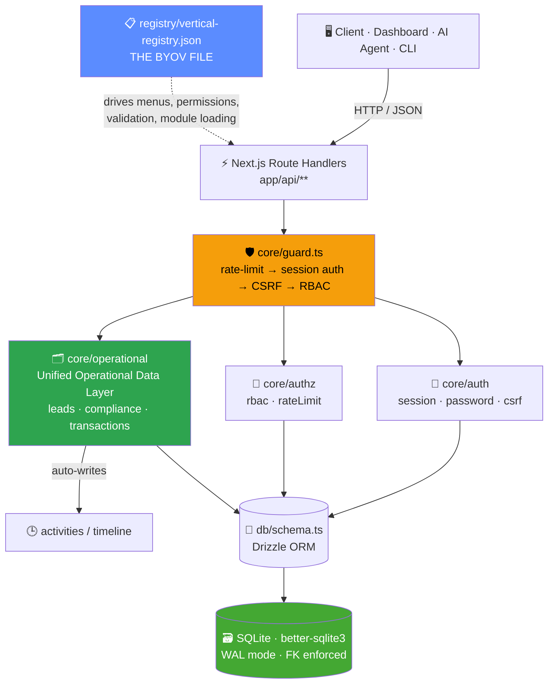
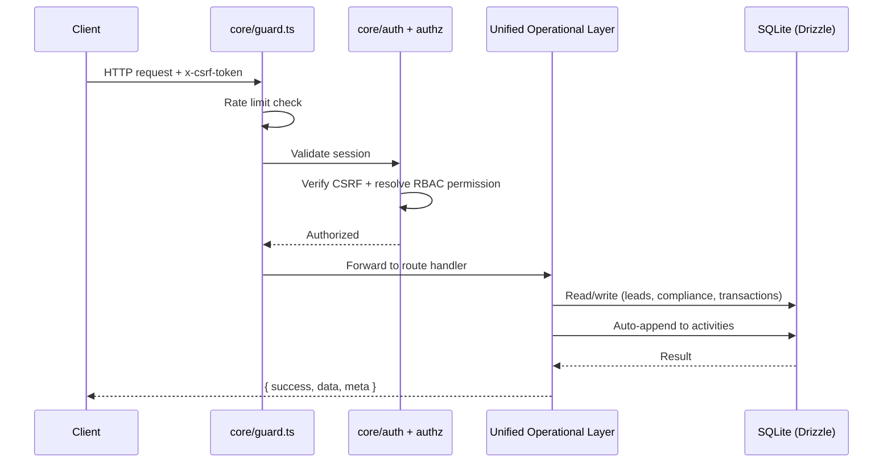

<div align="center">


<br/>

### One backend. Any industry. Add a vertical by editing a JSON file — never `core/`.

[](#-installation)
[](#-technology-stack)
[](#-technology-stack)
[](#-technology-stack)
[](#-testing)
[](#-license)

<sub>Built by <b>SAYANJALI NEXUS PRIVATE LIMITED</b> · <a href="https://github.com/SHalimoosavi/SYJ-Nexus-Engine">github.com/SHalimoosavi/SYJ-Nexus-Engine</a></sub>

</div>

<br/>

```
$ whoami
> A single operational backbone that runs a lead pipeline, a compliance log,
> a transaction ledger, and an audit trail — for ANY industry — without
> touching backend code. The industry-specific parts live in one JSON file.
```

> 🎬 **Demo:** drop a short terminal recording (`asciinema` or a screen capture of `init.sh` running end-to-end) at `docs/demo.gif` and reference it here as ``. Left out of this README rather than linking a placeholder that doesn't exist yet.

<br/>

## 📚 Table of Contents

| | | |
|---|---|---|
| [01 · Overview](#01--overview) | [07 · Initialization](#07--initialization) | [13 · Security Model](#13--security-model) |
| [02 · Architecture](#02--architecture) | [08 · Development](#08--development) | [14 · Testing](#14--testing) |
| [03 · Folder Structure](#03--folder-structure) | [09 · Production Deployment](#09--production-deployment) | [15 · License](#15--license) |
| [04 · Technology Stack](#04--technology-stack) | [10 · Configuration](#10--configuration) | [16 · Contributing](#16--contributing) |
| [05 · ⚠️ Termux Compatibility](#05--️-termux-compatibility-notice) | [11 · Vertical Registry (BYOV)](#11--vertical-registry-byov) | [17 · Troubleshooting](#17--troubleshooting) |
| [06 · Installation](#06--installation) | [12 · API Documentation](#12--api-documentation) | [18 · FAQ](#18--faq) |

<br/>

## 01 · Overview

SYJ Nexus Engine is a **headless**, **API-first**, **configuration-driven** enterprise operating framework. Agriculture, manufacturing, logistics, retail, healthcare, education, hospitality, construction, finance, government, real estate, SaaS, consulting — or one you invent — all run on the same backend.

**Bring Your Own Vertical (BYOV)** means adding an industry is a JSON diff, not a pull request against `core/`.

### ✨ Key Features

- 🏭 **13 industries, one engine** — agriculture to government, all sharing the same backend
- 🧩 **BYOV (Bring Your Own Vertical)** — add an industry by editing a single JSON file, zero backend changes
- 🔌 **Headless & API-first** — 22 route handlers, clean JSON envelopes, built for dashboards *and* AI agents
- 🗄️ **Unified Operational Data Layer** — leads, compliance logs, and transactions share one list/get/create/update interface, with every mutation auto-logged to the activity timeline
- 🔐 **Security by default** — `crypto.scrypt` password hashing, HMAC-signed sessions, double-submit CSRF, RBAC, rate limiting, and a durable audit trail — all with zero native crypto addons
- 🪶 **Zero external services** — SQLite via Drizzle ORM, no Postgres/MongoDB/Firebase/Supabase required
- ⚙️ **Config over code** — deployment settings in `.env`; per-tenant runtime settings in a live Configuration Manager
- 🧪 **37 tests passing** — Vitest across registry, core, db, and API layers
- 📦 **One-shot installer** — `./init.sh` handles dependencies, environment, migrations, and seeding, and is fully idempotent

<br/>

## 02 · Architecture



Every domain module — leads, compliance logs, transactions — is a thin layer over the same **Unified Operational Data Layer**. One consistent interface for list / get / create / update, and every mutation automatically appends to `activities`, so the timeline is never out of sync.

### Request lifecycle



<br/>

## 03 · Folder Structure

```bash
syj-nexus-engine/
├── app/
│   ├── api/                  # 22 route handlers — the entire backend surface
│   │   ├── auth/             #   login · logout · session
│   │   ├── organizations/    #   register (bootstrap) · [id]
│   │   ├── users/            #   list/create · [id]
│   │   ├── verticals/        #   registry-driven vertical list
│   │   ├── leads/            #   unified operational layer
│   │   ├── compliance/       #   unified operational layer
│   │   ├── transactions/     #   unified operational layer
│   │   ├── activity/         #   org feed + per-entity timeline
│   │   ├── search/           #   global search
│   │   ├── settings/         #   config manager + api-keys
│   │   ├── system/           #   status snapshot + audit read
│   │   └── health/           #   public liveness probe
│   └── layout.tsx / page.tsx / globals.css
├── core/
│   ├── auth/                 # password · session · csrf · guard
│   ├── authz/                # rbac · rate limiting
│   ├── logging/               # structured logger + durable audit writer
│   ├── errors/                 # typed AppError hierarchy + response envelope
│   ├── validation/            # Zod schemas
│   └── operational/           # ★ the Unified Operational Data Layer
├── db/
│   ├── schema.ts               # every table, one file
│   ├── client.ts               # the ONLY file that imports better-sqlite3
│   └── migrations/             # generated by drizzle-kit
├── registry/
│   ├── vertical-registry.json  # ★ edit THIS to add an industry
│   └── schema.ts / loader.ts   # validation + cached loader
├── modules/                    # optional extension layer (event bus, etc.)
├── hooks/  · components/       # client-side API hook + UI primitives
├── scripts/                    # migrate · seed · init · health-check
├── tests/                       # Vitest — registry, core, db, api
├── docs/ARCHITECTURE.md         # deep-dive design rationale
└── init.sh                      # one-shot installer
```

<br/>

## 04 · Technology Stack

| Layer | Choice | Why |
|---|---|---|
| Frontend | Next.js 14 (App Router) · TypeScript · React | one runtime, server components |
| Backend | Next.js Route Handlers | no separate Express server |
| Database | Drizzle ORM + better-sqlite3 | zero external services |
| Styling | Tailwind CSS | no UI framework overhead |
| Validation | Zod | typed, composable, runtime-safe |
| Password hashing | Node built-in `crypto.scrypt` | **no native addon** — see [§05](#05--️-termux-compatibility-notice) |
| Testing | Vitest | fast, ESM-native |

**Explicitly excluded:** Prisma, MongoDB, Firebase, Supabase, Electron, Docker-as-a-requirement, heavy enterprise frameworks. `node` + `npm` is the whole runtime dependency.

<br/>

## 05 · ⚠️ Termux Compatibility Notice

Nexus Engine is designed primarily for standard Linux, macOS, and Windows development environments. While much of the codebase is compatible with Android Termux, some native Node.js dependencies may not compile successfully due to Termux's limited native build environment.

**Current limitation:** the database driver is `better-sqlite3`, which requires native compilation via `node-gyp`. Prebuilt binaries aren't available for Android/Termux, so `npm install` may fail with native-compilation or Android NDK errors.

> This is an environmental limitation, not an issue with the Nexus Engine source code.

| Platform | Status |
|---|:---:|
| Linux | ✅ Supported |
| macOS | ✅ Supported |
| Windows | ✅ Supported |
| Android Termux | ⚠️ Limited (native dependency issue) |

**Recommended dev environments:** Ubuntu/Debian, Fedora/RHEL, Arch Linux, macOS, Windows (WSL2 or native Node.js).

**Planned improvement:** a future release replaces the native database driver with a portable, zero-native-build option (e.g. `sql.js` or another WebAssembly-based driver) for full Termux compatibility alongside continued desktop/server support.

> **Note:** this limitation only affects local development on Android Termux. Deployments on standard Linux servers, VPSs, containers, and cloud environments are the primary supported targets for the current release.

<br/>

## 06 · Installation

**Step 1 — Clone the repository**

```bash
git clone https://github.com/SHalimoosavi/SYJ-Nexus-Engine.git
cd SYJ-Nexus-Engine
```

**Step 2 — Make the installer executable and run it**

```bash
chmod +x init.sh
./init.sh
```

You'll see:

```
[init] Checking Node.js...
[ok]   Node.js v20.11.0 detected
[init] Checking npm...
[ok]   npm 10.2.4 detected
[init] Installing dependencies...
[ok]   Dependencies installed
[init] Checking environment configuration...
[ok]   .env created with freshly generated secrets
[init] Applying migrations...
[ok]   Migrations applied
[init] Seeding baseline data...
[ok]   Baseline data seeded
[init] Verifying installation...
[ok]   Health check passed

==================================================
   SYJ Nexus Engine is ready.
==================================================
```

**Step 3 — Start the dev server**

```bash
npm run dev
```

Visit `http://localhost:3000` — the API is live at `http://localhost:3000/api`.

> ✅ `init.sh` is fully idempotent — safe to re-run any time something looks off.
> ⚠️ On Android/Termux, see [§05](#05--️-termux-compatibility-notice) before running `npm install`.

<br/>

## 07 · Initialization

If you'd rather run each step manually instead of `init.sh`:

```bash
npm install            # install dependencies
npm run db:generate    # generate SQL migrations from db/schema.ts
npm run db:migrate     # apply migrations to the SQLite file
npm run db:seed        # seed default org / admin user / sample data
npm run health          # verify DB + registry are readable
```

Seeded admin credentials come from `SEED_ADMIN_EMAIL` / `SEED_ADMIN_PASSWORD` in `.env` and are printed at the end of `db:seed`.

> 🔒 **Change the seeded admin password immediately after first login.**

<br/>

## 08 · Development

```bash
npm run dev
```

```
   ▲ Next.js 14.2.15
   - Local:  http://localhost:3000
   - API:    http://localhost:3000/api

 ✓ Ready in 890ms
```

| Command | Purpose |
|---|---|
| `npm run lint` | ESLint |
| `npm run typecheck` | `tsc --noEmit`, strict mode |
| `npm run test` | Vitest suite (one-shot) |
| `npm run test:watch` | Vitest in watch mode |
| `npm run clean` | Remove `.next/` build cache |

<br/>

## 09 · Production Deployment

```bash
npm run build
npm run start
```

Because the stack is Node + SQLite, this runs on any VPS, a Raspberry Pi, or — outside local development — on Android hardware via a properly configured Node runtime. Containerizing it is a deployment choice, never a requirement.

> **Scaling note:** the in-memory rate limiter and SQLite itself assume a single Node process. For multi-instance deployments, put a shared store behind `core/authz/rateLimit.ts`. `db/client.ts` is the *only* file that imports `better-sqlite3` directly, so swapping the dialect for a networked database later is a contained, single-file change.

<br/>

## 10 · Configuration

All deployment config lives in `.env` (see `.env.example`, fully documented inline — **never commit a real `.env`**).

Per-organization *runtime* settings (feature flags, display preferences, per-tenant toggles) go through the `/api/settings` key-value store instead — the **Configuration Manager**, meant for things that change without a redeploy.

<br/>

## 11 · Vertical Registry (BYOV)

```json
// registry/vertical-registry.json
{
  "id": "retail",
  "name": "Retail",
  "description": "Storefront operations, customer leads, and inventory-linked transactions.",
  "enabled": true,
  "leadStages": ["inquiry", "cart", "checkout", "won", "lost"],
  "complianceTypes": ["trade_license", "tax_registration"],
  "permissions": ["retail:read", "retail:write", "retail:admin"]
}
```

Append an object → the vertical appears in `GET /api/verticals`, becomes a valid `verticalId` on every lead/compliance/transaction create call, and its permissions become assignable to roles.

**No code change. No redeploy logic. No migration.**

13 verticals ship pre-configured:

`agriculture` · `manufacturing` · `logistics` · `retail` · `healthcare` · `education` · `hospitality` · `construction` · `finance` · `government` · `real_estate` · `saas` · `consulting`

— delete, disable (`"enabled": false`), or replace freely.

<br/>

## 12 · API Documentation

Every response shares one envelope:

```jsonc
{ "success": true,  "data": { /* ... */ }, "meta": { /* optional */ } }
{ "success": false, "error": { "code": "VALIDATION_ERROR", "message": "...", "details": [] } }
```

Mutating requests require the `x-csrf-token` header (from `/api/auth/login` or `/session`).

| Route | Methods | Auth | Purpose |
|---|---|:---:|---|
| `/api/organizations/register` | `POST` | public | Bootstrap a new tenant + first admin |
| `/api/auth/login` | `POST` | public | Authenticate → session cookie + CSRF token |
| `/api/auth/logout` | `POST` | session | Revoke current session |
| `/api/auth/session` | `GET` | public | Check current auth state |
| `/api/users` `/api/users/{id}` | `GET POST PATCH` | session | Manage users + roles |
| `/api/organizations/{id}` | `GET PATCH` | session | View / update tenant |
| `/api/verticals` | `GET` | session | Registry-driven vertical list |
| `/api/leads` `/api/leads/{id}` | `GET POST PATCH` | session | Unified data layer — leads |
| `/api/compliance` `/api/compliance/{id}` | `GET POST PATCH` | session | Compliance logs |
| `/api/transactions` `/api/transactions/{id}` | `GET POST PATCH` | session | Transactions |
| `/api/activity` | `GET` | session | Org-wide activity feed |
| `/api/activity/{entityType}/{entityId}` | `GET` | session | Per-record timeline |
| `/api/search` | `GET` | session | Global search |
| `/api/settings` `/api/settings/api-keys` | `GET PUT POST` | session | Config + API keys |
| `/api/system` `/api/system/audit` | `GET` | session | Status snapshot + audit read |
| `/api/health` | `GET` | public | Liveness/readiness probe |

> 🤖 **Built for AI-agent access.** No LLM-specific code — just clean, typed CRUD + search + timeline semantics that any autonomous agent can call over plain HTTP.

<br/>

## 13 · Security Model

| Layer | Implementation |
|---|---|
| 🔑 Passwords | `crypto.scrypt` · random salt · timing-safe compare · zero native addons |
| 🍪 Sessions | Server-side rows · HMAC-signed cookie · `httpOnly` · `sameSite=lax` |
| 🛡️ CSRF | Double-submit token, required on every mutating request |
| 👥 RBAC | `users → roles → permissions`, resolved in one module |
| ⏱️ Rate limiting | Sliding window, per client IP |
| 📜 Audit trail | Durable row per security-relevant action |
| 🚫 Error responses | Generic to the client, full detail server-side only |
| 🧱 Secure headers | `X-Frame-Options` · `Permissions-Policy` · `Referrer-Policy` |

<br/>

## 14 · Testing

```bash
npm run test
```

```
 ✓ tests/registry/loader.test.ts       (7 tests)
 ✓ tests/core/password.test.ts         (9 tests)
 ✓ tests/core/validation.test.ts       (9 tests)
 ✓ tests/db/operational.test.ts        (3 tests)
 ✓ tests/api/handler.test.ts           (9 tests)

 Test Files  5 passed (5)
      Tests  37 passed (37)
```

<br/>

## 15 · License

MIT — see [`LICENSE`](./LICENSE). Copyright © 2026 SAYANJALI NEXUS PRIVATE LIMITED.

<br/>

## 16 · Contributing

1. Fork → feature branch → one concern per PR
2. Run `npm run lint && npm run typecheck && npm run test` before opening it
3. New table → include the migration (`npm run db:generate`)
4. Vertical-facing feature → extend `vertical-registry.json` before touching `core/`

<br/>

## 17 · Troubleshooting

| Symptom | Fix |
|---|---|
| `init.sh: permission denied` | `chmod +x init.sh` |
| `SESSION_SECRET is not configured` | Re-run `./init.sh`, or set it manually in `.env` (64-hex chars) |
| `better-sqlite3` fails to build | See [§05 Termux Notice](#05--️-termux-compatibility-notice) — install build tools or switch platform |
| `db:migrate` does nothing | Run `npm run db:generate` first |
| `401` on every call | Register → login → send `csrfToken` as `x-csrf-token` on mutations |

<br/>

## 18 · FAQ

**Can I add a vertical without redeploying?**
Edit `vertical-registry.json`, restart the process. No code to touch.

**Why SQLite instead of Postgres/MySQL?**
Zero external services was a hard constraint. `db/client.ts` is the only file that knows it's SQLite — swapping dialects later is contained, not a rewrite.

**Does this ship a full admin UI?**
No — the UI is a minimal status dashboard. The framework is intentionally headless/API-first.

**Is there LLM-specific code anywhere?**
No. The operational API is just clean, typed, predictable HTTP + JSON.

<br/>

<div align="center">
<sub><b>SYJ NEXUS ENGINE</b> · SAYANJALI NEXUS PRIVATE LIMITED · MIT LICENSED</sub>
</div>
